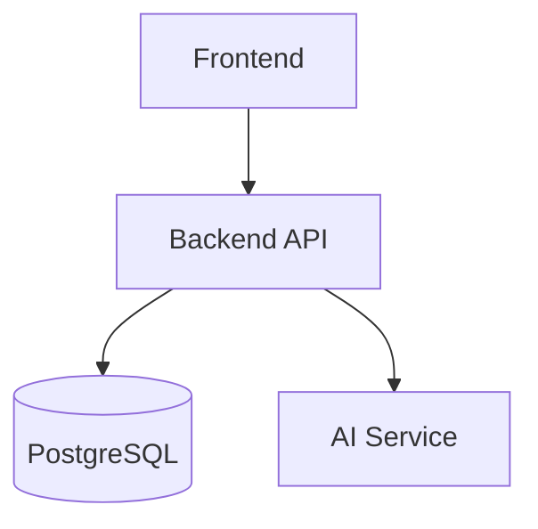

# Barranquilla Explora

Barranquilla Explora is a web application focused on promoting Barranquilla's tourism and cultural offerings. The platform allows users to explore tourist attractions, discover events, create personalized itineraries, and provides dedicated profiles for explorers, organizers, and administrators.

---

## Table of Contents

- [Project Description](#project-description)
- [Key Features](#key-features)
- [Technology Stack](#technology-stack)
- [System Architecture](#system-architecture)
- [Project Structure](#project-structure)
- [Installation](#installation)
- [Running the Application](#running-the-application)
- [Environment Variables](#environment-variables)
- [Database](#database)
- [Best Practices](#best-practices)
- [Future Improvements](#future-improvements)
- [Authors](#authors)

---

## Project Description

The purpose of this project is to centralize Barranquilla's tourism and cultural information into a single platform. Users can explore recommended places, browse upcoming events, create personalized itineraries, and receive guidance through an AI-powered virtual assistant.

The platform is designed for:

- **Explorers** who want to discover places and events throughout the city.
- **Organizers** who can register and manage places or events.
- **Administrators** who oversee platform content, users, and requests.

---

## Key Features

### User Authentication

- User registration.
- User login.
- Frontend session management.
- Role-based route protection on the frontend.

### Tourist Attractions

- Browse registered tourist attractions.
- View detailed information about each location.
- Browse attraction categories.
- Display featured attractions.
- Create new tourist attractions through the organizer profile.

### Events

- Browse registered events.
- View detailed event information.
- Display featured events.
- Create new events through the organizer profile.
- Event schedules.
- Event reviews and ratings.

### Itineraries

- Create personalized itineraries.
- View user itineraries.
- Display itinerary details.
- Associate tourist attractions and events with an itinerary.
- Delete itineraries.

### User Profiles

- Explorer profile.
- Organizer profile.
- Administrative dashboard for managing users, tourist attractions, events, reviews, and requests.

### Virtual Assistant

- Integrated AI chatbot.
- Answers questions related to registered places, events, and itineraries.
- Communication with the AI service is handled through the backend.

---

## Technology Stack

### Frontend

- **JavaScript:** Primary programming language for the user interface.
- **Vite:** Frontend development and build tool.
- **Tailwind CSS:** Utility-first CSS framework for styling.
- **SweetAlert2:** Interactive alerts and notifications.
- **DOMPurify** and **Marked:** Libraries used to safely render Markdown content when required.

### Backend

- **Node.js:** Server-side runtime environment.
- **Express.js:** Framework for building the REST API.
- **PostgreSQL:** Relational database management system.
- **pg:** PostgreSQL client for Node.js.
- **bcrypt:** Password hashing.
- **dotenv:** Environment variable management.
- **cors:** Enables secure communication between frontend and backend.

### Development Tools

- **npm:** Dependency and package manager.
- **Git:** Version control system.

---

## System Architecture

The project is divided into two main applications:

- **Frontend:** Web application built with Vite.
- **Backend:** REST API developed with Express.js.

The frontend communicates with the backend through HTTP requests. The backend processes business logic, interacts with the PostgreSQL database, and communicates with the AI service when needed.



---

## Project Structure

```text
Proyecto-Integrador-Turismo-/
├── backend/
│   ├── src/
│   │   ├── config/
│   │   ├── controllers/
│   │   ├── prompts/
│   │   ├── querys/
│   │   ├── routes/
│   │   ├── services/
│   │   ├── tools/
│   │   ├── utils/
│   │   ├── validators/
│   │   ├── app.js
│   │   └── server.js
│   └── package.json
│
├── frontend/
│   ├── public/
│   ├── src/
│   │   ├── app/
│   │   ├── assets/
│   │   ├── components/
│   │   ├── middleware/
│   │   ├── pages/
│   │   ├── router/
│   │   ├── services/
│   │   ├── styles/
│   │   └── main.js
│   └── package.json
│
└── README.md
```

### Backend

- `config/`: Database connection configuration.
- `routes/`: API route definitions.
- `controllers/`: Request and response handling.
- `services/`: Business logic.
- `querys/`: SQL queries.
- `validators/`: Input validation.
- `prompts/`, `tools/`, and `utils/`: AI assistant support modules.

### Frontend

- `pages/`: Main application views.
- `components/`: Reusable UI components.
- `services/`: API communication layer.
- `router/`: Frontend routing.
- `middleware/`: Session and role-based access control.
- `assets/` and `public/`: Static resources.

---

## Installation

### Requirements

- Node.js installed.
- npm installed.
- PostgreSQL installed and configured.

### Backend

```bash
cd backend
npm install
```

### Frontend

```bash
cd frontend
npm install
```

---

## Running the Application

### Backend

```bash
cd backend
npm run dev
```

### Frontend

```bash
cd frontend
npm run dev
```

For production builds:

```bash
npm run build
```

---

## Environment Variables

The project uses `.env` files to store environment-specific and sensitive configuration.

### Backend

The backend requires environment variables for:

- Application port.
- PostgreSQL database connection.
- AI service configuration (when using the chatbot).

### Frontend

The frontend requires an environment variable specifying the backend base URL.

> **Note:** For security reasons, this repository does not include real credentials or example environment values.

---

## Database

The application uses PostgreSQL as its relational database.

The main entities include:

- Users
- Roles
- Categories
- Tourist Attractions
- Events
- Event Schedules
- Reviews
- Itineraries

The repository does not include versioned SQL migrations. Therefore, the database must be prepared according to the schema expected by the backend.

---

## Best Practices

- Clear separation between frontend and backend.
- Modular backend architecture organized by routes, controllers, services, queries, and validators.
- Environment variables used for configuration management.
- `.env` files, dependencies, and build artifacts excluded through `.gitignore`.
- Passwords are securely hashed before storage.
- Frontend services are separated from UI components to simplify API consumption.

---

## Future Improvements

- Add version-controlled database migrations.
- Implement automated testing.
- Improve backend security for protected routes.
- Add more comprehensive form validation.
- Optimize search and filtering performance.

---

## Authors

- **Daniel Mendoza** – Team Leader
- **Luis Mejía**
- **Eduardo**
- **Cristian Albor**
- **Mateo Mercado**
- **Jhonatan**
